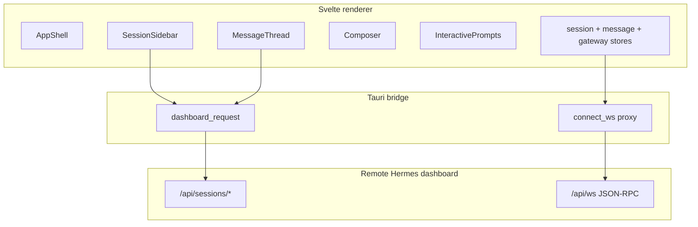

# Overview — BITCH Desktop

BITCH Desktop is a Tauri + Svelte 5 desktop client for remote Hermes dashboard
gateway access. This document indexes the architecture wiki (`docs/wiki/`) and
the forward roadmap (`docs/plans/roadmap.md`).

All dashboard auth and HTTP stays in the Tauri Rust bridge, never in the
renderer.

## Transport split

The official desktop app talks to the gateway two ways. BITCH mirrors that split:

- **WebSocket JSON-RPC** — live turns: `prompt.submit`, `session.create`,
  `session.resume`, `session.interrupt`, and interactive `*.respond` calls.
- **HTTP dashboard API** — session list, search, stored messages,
  rename/archive/delete. Electron exposes this as `window.hermesDesktop.api`;
  BITCH exposes a `dashboard_request` Tauri command instead.

## Feature parity matrix

| Include (~1:1 feature)                                                  | Exclude (local-only / out of scope)                     |
| ----------------------------------------------------------------------- | ------------------------------------------------------- |
| Chat shell: sidebar + thread + composer                                 | Spawn/boot local `hermes dashboard`                     |
| Session list, switch, new, rename, archive, delete                      | Onboarding, self-update, gateway restart UX             |
| FTS session search, pinned sessions, working indicators                 | Electron file tree, node-pty terminal, right-rail xterm |
| Load history + live stream (`message.*`, `thinking.*`, `tool.*`)        | Local workspace `cwd` picker tied to agent FS           |
| Rich composer: send, interrupt, queue, slash, attachments, model switch | Voice conversation mode (deferred to roadmap)           |
| Clarify, approval, sudo, secret modals                                  | Settings / skills / cron / messaging admin pages        |
| `commands.catalog` + `slash.exec` where the gateway exposes them        | Desktop-only slash commands that assume local IPC       |

## Architecture wiki (delivered features)

| Feature             | Doc                                                                  | Upstream reference                                                                                                                   |
| ------------------- | -------------------------------------------------------------------- | ------------------------------------------------------------------------------------------------------------------------------------ |
| Tauri HTTP bridge   | [`docs/wiki/http-bridge.md`](../wiki/http-bridge.md)                 | [electron/preload.cjs](https://github.com/NousResearch/hermes-agent/blob/main/apps/desktop/electron/preload.cjs)                     |
| App shell & routing | [`docs/wiki/app-shell.md`](../wiki/app-shell.md)                     | [app-shell.tsx](https://github.com/NousResearch/hermes-agent/blob/main/apps/desktop/src/app/shell/app-shell.tsx)                     |
| Session sidebar     | [`docs/wiki/session-sidebar.md`](../wiki/session-sidebar.md)         | [sidebar/index.tsx](https://github.com/NousResearch/hermes-agent/blob/main/apps/desktop/src/app/chat/sidebar/index.tsx)              |
| Message thread      | [`docs/wiki/message-thread.md`](../wiki/message-thread.md)           | [thread.tsx](https://github.com/NousResearch/hermes-agent/blob/main/apps/desktop/src/components/assistant-ui/thread.tsx)             |
| Rich composer       | [`docs/wiki/rich-composer.md`](../wiki/rich-composer.md)             | [composer/index.tsx](https://github.com/NousResearch/hermes-agent/blob/main/apps/desktop/src/app/chat/composer/index.tsx)            |
| Interactive prompts | [`docs/wiki/interactive-prompts.md`](../wiki/interactive-prompts.md) | [clarify-tool.tsx](https://github.com/NousResearch/hermes-agent/blob/main/apps/desktop/src/components/assistant-ui/clarify-tool.tsx) |

## Roadmap

Future candidates, upstream references, and deferred features at
[`docs/plans/roadmap.md`](roadmap.md).

## Conventions

- **UI:** Bits UI + Tailwind per [`AGENTS.md`](../../AGENTS.md). Avoid bespoke CSS
  outside [`src/app.css`](../../src/app.css) tokens.
- **State:** Svelte 5 runes (`$state`, `$derived`) in `.svelte.ts` stores. No
  nanostores; the upstream nanostore atoms are hand-ported to runes.
- **Upstream sync:** keep copying only
  [`json-rpc-gateway.ts`](../../src/lib/gateway/json-rpc-gateway.ts) via
  `npm run sync:transport`; hand-port everything else.
- **Auth:** never expose `BITCH_DASHBOARD_API_KEY` to Vite; all REST goes through
  the Tauri `dashboard_request` command.

## RPC and event contracts (quick reference)

WebSocket RPC methods used:

| Method              | Params                     | Notes                            |
| ------------------- | -------------------------- | -------------------------------- |
| `session.create`    | `{ cols: 96, cwd? }`       | returns `SessionCreateResponse`  |
| `session.resume`    | `{ session_id, cols? }`    | returns `SessionResumeResponse`  |
| `session.close`     | `{ session_id }`           |                                  |
| `session.interrupt` | `{ session_id }`           |                                  |
| `session.usage`     | `{ session_id }`           | returns `UsageStats`             |
| `prompt.submit`     | `{ session_id, text }`     |                                  |
| `commands.catalog`  | `{ session_id }`           | slash command list               |
| `slash.exec`        | `{ session_id, command }`  | also used for `/model` switch    |
| `clarify.respond`   | `{ request_id, answer }`   |                                  |
| `approval.respond`  | `{ choice, session_id }`   | `once`/`session`/`always`/`deny` |
| `sudo.respond`      | `{ request_id, password }` |                                  |
| `secret.respond`    | `{ request_id, value }`    |                                  |

Server-push events (`gateway.on(...)`): `gateway.ready`, `session.info`,
`message.start`, `message.delta`, `message.complete`, `thinking.delta`
(ignored — spinner status), `reasoning.delta`, `reasoning.available`,
`status.update`, `tool.start`, `tool.progress`, `tool.generating`,
`tool.complete`, `clarify.request`, `approval.request`, `sudo.request`,
`secret.request`, `error`.

HTTP dashboard endpoints used:

| Endpoint                                                 | Method | Purpose                                     |
| -------------------------------------------------------- | ------ | ------------------------------------------- |
| `/api/sessions?limit&offset&min_messages&archived&order` | GET    | list                                        |
| `/api/sessions/search?q=`                                | GET    | full-text search                            |
| `/api/sessions/:id/messages`                             | GET    | stored transcript                           |
| `/api/sessions/:id`                                      | PATCH  | rename (`{title}`) / archive (`{archived}`) |
| `/api/sessions/:id`                                      | DELETE | delete                                      |
| `/api/model/info`                                        | GET    | current global model                        |
| `/api/model/options`                                     | GET    | model picker options                        |

## Upstream reference index

Repo: [NousResearch/hermes-agent](https://github.com/NousResearch/hermes-agent) (`main`).

### Shared / transport

| Role                       | Upstream                                                                                                          | BITCH local                                                                        |
| -------------------------- | ----------------------------------------------------------------------------------------------------------------- | ---------------------------------------------------------------------------------- |
| JSON-RPC client + events   | [json-rpc-gateway.ts](https://github.com/NousResearch/hermes-agent/blob/main/apps/shared/src/json-rpc-gateway.ts) | [`src/lib/gateway/json-rpc-gateway.ts`](../../src/lib/gateway/json-rpc-gateway.ts) |
| Gateway subclass           | [hermes.ts](https://github.com/NousResearch/hermes-agent/blob/main/apps/desktop/src/hermes.ts)                    | [`src/lib/gateway/hermes.ts`](../../src/lib/gateway/hermes.ts)                     |
| Chat message normalization | [chat-runtime.ts](https://github.com/NousResearch/hermes-agent/blob/main/apps/desktop/src/lib/chat-runtime.ts)    | `src/lib/messages/chat-runtime.ts`                                                 |
| API / session types        | [types/hermes.ts](https://github.com/NousResearch/hermes-agent/blob/main/apps/desktop/src/types/hermes.ts)        | `src/lib/types/hermes.ts`                                                          |

### Per-feature upstream files

- **HTTP bridge:** [electron/preload.cjs](https://github.com/NousResearch/hermes-agent/blob/main/apps/desktop/electron/preload.cjs), [main.cjs](https://github.com/NousResearch/hermes-agent/blob/main/apps/desktop/electron/main.cjs)
- **App shell:** [desktop-controller.tsx](https://github.com/NousResearch/hermes-agent/blob/main/apps/desktop/src/app/desktop-controller.tsx), [app-shell.tsx](https://github.com/NousResearch/hermes-agent/blob/main/apps/desktop/src/app/shell/app-shell.tsx), [use-gateway-request.ts](https://github.com/NousResearch/hermes-agent/blob/main/apps/desktop/src/app/gateway/hooks/use-gateway-request.ts), [store/gateway.ts](https://github.com/NousResearch/hermes-agent/blob/main/apps/desktop/src/store/gateway.ts), [store/layout.ts](https://github.com/NousResearch/hermes-agent/blob/main/apps/desktop/src/store/layout.ts)
- **Session sidebar:** [sidebar/index.tsx](https://github.com/NousResearch/hermes-agent/blob/main/apps/desktop/src/app/chat/sidebar/index.tsx), [session-row.tsx](https://github.com/NousResearch/hermes-agent/blob/main/apps/desktop/src/app/chat/sidebar/session-row.tsx), [session-actions-menu.tsx](https://github.com/NousResearch/hermes-agent/blob/main/apps/desktop/src/app/chat/sidebar/session-actions-menu.tsx), [store/session.ts](https://github.com/NousResearch/hermes-agent/blob/main/apps/desktop/src/store/session.ts)
- **Message thread:** [use-message-stream.ts](https://github.com/NousResearch/hermes-agent/blob/main/apps/desktop/src/app/session/hooks/use-message-stream.ts), [thread.tsx](https://github.com/NousResearch/hermes-agent/blob/main/apps/desktop/src/components/assistant-ui/thread.tsx), [markdown-text.tsx](https://github.com/NousResearch/hermes-agent/blob/main/apps/desktop/src/components/assistant-ui/markdown-text.tsx), [tool-fallback.tsx](https://github.com/NousResearch/hermes-agent/blob/main/apps/desktop/src/components/assistant-ui/tool-fallback.tsx)
- **Rich composer:** [composer/index.tsx](https://github.com/NousResearch/hermes-agent/blob/main/apps/desktop/src/app/chat/composer/index.tsx), [use-composer-actions.ts](https://github.com/NousResearch/hermes-agent/blob/main/apps/desktop/src/app/chat/hooks/use-composer-actions.ts), [use-prompt-actions.ts](https://github.com/NousResearch/hermes-agent/blob/main/apps/desktop/src/app/session/hooks/use-prompt-actions.ts), [store/composer.ts](https://github.com/NousResearch/hermes-agent/blob/main/apps/desktop/src/store/composer.ts), [composer-queue.ts](https://github.com/NousResearch/hermes-agent/blob/main/apps/desktop/src/store/composer-queue.ts)
- **Interactive prompts:** [clarify-tool.tsx](https://github.com/NousResearch/hermes-agent/blob/main/apps/desktop/src/components/assistant-ui/clarify-tool.tsx), [tool-approval.tsx](https://github.com/NousResearch/hermes-agent/blob/main/apps/desktop/src/components/assistant-ui/tool-approval.tsx), [store/clarify.ts](https://github.com/NousResearch/hermes-agent/blob/main/apps/desktop/src/store/clarify.ts), [store/prompts.ts](https://github.com/NousResearch/hermes-agent/blob/main/apps/desktop/src/store/prompts.ts)

## Validation checklist

Run after each change that touches the relevant layer:

| Touch    | Commands                                                                              |
| -------- | ------------------------------------------------------------------------------------- |
| Renderer | `npm run type-check`, `npm run lint`, `npm run frontend:build`                        |
| Rust     | `bash scripts/rust-wrapper.sh cargo check --manifest-path src-tauri/Cargo.toml`       |
| Manual   | connect → new chat → send → stream → clarify/approve → switch session → history loads |
