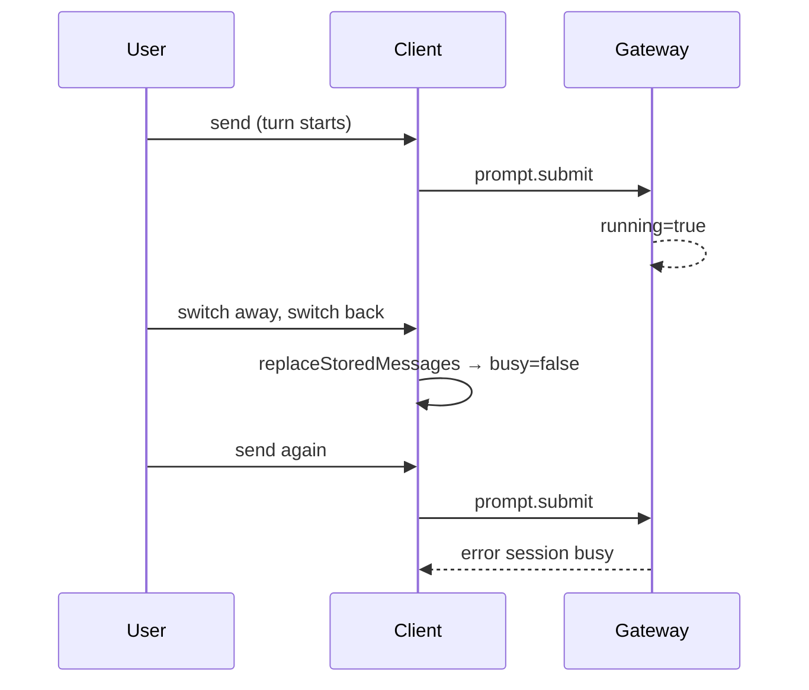

# Preserve in-progress thread when switching sessions

## Problems

### 1. Messages disappear on re-select

Returning to a session always runs [`resumeAndHydrateStoredSession`](src/lib/session/resume.ts), which **unconditionally** hydrates from the HTTP snapshot when non-empty. That calls [`replaceStoredMessages`](src/lib/stores/messages.svelte.ts), which:

- Replaces `thread.messages` with stored history only (no in-progress turn)
- Clears `currentAssistantId`, pending assistant state, and **`busy`**

Background streaming continues while away ([`sessionIdForEvent`](src/lib/stores/messages.svelte.ts) maps live runtime ids to the stored thread key), but re-select wipes that in-memory state.

### 2. "Session busy" on send after re-select

Hermes rejects `prompt.submit` while the **server** still has an active turn. After re-select, `replaceStoredMessages` sets **`thread.busy = false`** locally even when the gateway session is still `running`. The composer shows **Send** (not **Queue**), calls `prompt.submit`, and the gateway returns **"session busy"**.



These are the same root cause with two symptoms: **lost transcript** and **client/server busy desync**.

## Fix

### 1. Live-thread detection helper

Add to [`src/lib/stores/messages.svelte.ts`](src/lib/stores/messages.svelte.ts) (exported for tests):

```ts
export function shouldPreserveLiveThread(sessionId: string, snapshotLength: number): boolean {
  const thread = threadForSession(sessionId)
  if (!thread?.hydrated) return false

  if (thread.busy || thread.currentAssistantId) return true
  if (thread.messages.some(message => message.pending)) return true
  if (thread.messages.length > snapshotLength) return true

  return false
}
```

- **Live / streaming / ahead of snapshot** → preserve in-memory thread (your preference)
- **Idle and not ahead of snapshot** → refresh from HTTP snapshot

Preserving the live thread also preserves **`busy`**, so the composer correctly **queues** instead of calling `prompt.submit` while the turn is still active.

### 2. Gate snapshot hydration in resume flow

Update [`src/lib/session/resume.ts`](src/lib/session/resume.ts):

```ts
if (hasStoredSnapshot && !shouldPreserveLiveThread(sessionId, storedSnapshot.length)) {
  hydrateSessionMessagesFromGateway(sessionId, storedSnapshot)
}
```

Always call `resumeSession` so `activeSessionId` / runtime mapping is restored.

### 3. Sync gateway `running` after resume

When hydration is skipped **or** after any successful `session.resume`, align local busy with the gateway:

- [`SessionResumeResponse`](src/lib/types/hermes.ts) includes `info?: SessionRuntimeInfo` with `running?: boolean`
- Reuse existing [`applyRuntimeInfo`](src/lib/stores/messages.svelte.ts) logic (already sets busy from `payload.running` on `session.info` / `status.update`)

Add a small helper in `messages.svelte.ts` or `resume.ts`:

```ts
function syncRunningFromResume(sessionId: string, info?: SessionRuntimeInfo): void {
  if (typeof info?.running === 'boolean') {
    setThreadBusy(sessionId, info.running)
  }
}
```

Call it from `resumeAndHydrateStoredSession` after `resumeSession` returns. This covers cases where the live thread was preserved but `running` needs reaffirming, and cases where the cached-runtime fast path skips gateway messages but `info.running` may still be true.

**Note:** The cached-runtime shortcut in [`resumeSession`](src/lib/stores/session.svelte.ts) currently returns empty `messages` and no `info`. If that path is hit on re-select, consider a lightweight `session.info` RPC (or extend the cached response) so `running` is not stale. Prefer the smallest change that returns `info` from resume when available.

### 4. Recover from "session busy" on submit

Update [`submitPrompt`](src/lib/stores/composer.svelte.ts) error handling:

When `prompt.submit` fails with a message matching **session busy** (case-insensitive):

1. **Do not** leave the session locally idle — call `setThreadBusy(sessionId, true)`
2. **Do not** append a spurious assistant error for a normal busy rejection (or replace with a short system hint: turn still running)
3. If the user had text to send, **enqueue** it (same path as when `thread.busy` is already true) instead of discarding the draft

This is a safety net for any remaining client/server desync (missed events, reload edge cases).

```ts
function isSessionBusyError(error: unknown): boolean {
  const message = error instanceof Error ? error.message : String(error)
  return /session busy/i.test(message)
}
```

### 5. Tests

Extend [`src/lib/session/resume.test.ts`](src/lib/session/resume.test.ts):

| Case                   | Expect                                                                                                      |
| ---------------------- | ----------------------------------------------------------------------------------------------------------- |
| Live turn preserved    | Snapshot shorter than in-memory thread; user msg + partial assistant + `busy` remain after re-select        |
| Idle refresh           | Not busy, snapshot has newer history; thread replaced from snapshot                                         |
| First visit            | Empty store; snapshot hydrates as today                                                                     |
| Running sync on resume | `resumeSession` returns `info: { running: true }`; local `thread.busy` is true even if snapshot was skipped |

Add to [`src/lib/stores/composer.svelte.test.ts`](src/lib/stores/composer.svelte.test.ts) (or new test):

| Case                  | Expect                                                                                       |
| --------------------- | -------------------------------------------------------------------------------------------- |
| Session busy recovery | Mock `prompt.submit` rejection "session busy"; local busy re-set; draft enqueued or not lost |

Reuse gateway event + stored/live sid patterns from [`messages.svelte.test.ts`](src/lib/stores/messages.svelte.test.ts).

### 6. Docs

Update [`docs/wiki/app-shell.md`](docs/wiki/app-shell.md):

- Re-select refreshes from HTTP when idle; preserves in-memory streaming when a turn is in progress
- Busy state stays aligned with the gateway; queued sends drain when the turn settles
- "Session busy" from the gateway should no longer occur after a normal switch-back during streaming

## Validation

- `npm test -- src/lib/session/resume.test.ts src/lib/stores/composer.svelte.test.ts`
- `npm run type-check && npm run lint`

## Out of scope

- Full app reload during an active turn (in-memory state lost regardless)
- Automatic `session.interrupt` when detecting desync (user can still Stop manually)
- Merging snapshot + live tail for non-streaming edge cases
